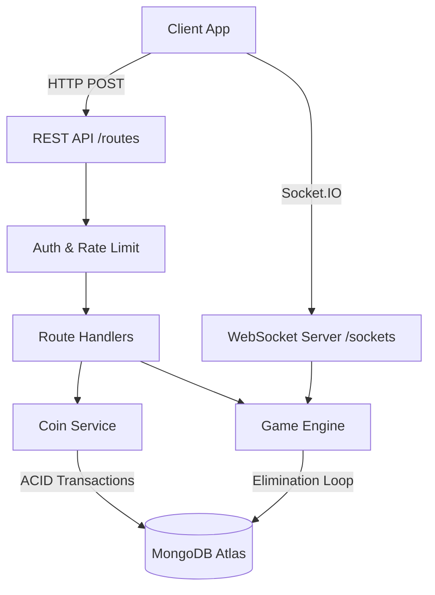

# RoxStar Spin Wheel Backend

Real-time multiplayer spin wheel game system built for RoxStar App (SMI Pvt Ltd).

## Tech Stack

- **Runtime**: Node.js + TypeScript
- **Framework**: Express.js
- **Database**: MongoDB (Mongoose)
- **Real-time**: Socket.IO (WebSockets)
- **Auth**: JWT RS256 (asymmetric keys)
- **Validation**: Zod
- **Logging**: Winston with daily rotation

## Prerequisites

- Node.js >= 18
- MongoDB Atlas account (or local MongoDB with replica set)
- Git

> **Note on Replica Set**: MongoDB transactions (used for atomic coin operations)
> require a replica set. MongoDB Atlas provides this by default.
> For local dev, start MongoDB with: `mongod --replSet rs0`

## Setup

### 1. Clone and install

```bash
git clone https://github.com/YOUR_USERNAME/roxstar-spinwheel-backend.git
cd roxstar-spinwheel-backend
npm install
```

### 2. Environment variables

```bash
cp .env.example .env
```

Fill in your `.env`:

```env
PORT=3000
NODE_ENV=development
ORIGIN_URL=*

DB_HOST=your-cluster.mongodb.net
DB_NAME=roxstar_spinwheel
DB_USER=your_db_user
DB_USER_PASSWORD=your_db_password
DB_MIN_POOL_SIZE=2
DB_MAX_POOL_SIZE=10

ACCESS_TOKEN_VALIDITY_SEC=3600
REFRESH_TOKEN_VALIDITY_SEC=86400
TOKEN_ISSUER=roxstar
TOKEN_AUDIENCE=roxstar-app

LOG_DIRECTORY=logs
```

### 3. Generate RSA keys

```bash
npm run generate-keys
```

This creates `keys/private.pem` and `keys/public.pem`. Never commit these.

### 4. Seed the database

```bash
# Creates USER and ADMIN roles + default GameConfig (70% winner, 20% admin, 10% app)
npm run seed:roles

# Generates an API key — copy this, you need it in every request header
npm run seed:apikey
```

### 5. Run

```bash
# Development (hot reload)
npm run dev

# Production
npm run build
npm start
```

## API Reference

All requests require the header: `x-api-key: YOUR_API_KEY`

Protected routes also require: `Authorization: Bearer YOUR_ACCESS_TOKEN`

### Auth

| Method | Endpoint              | Auth | Description   |
| ------ | --------------------- | ---- | ------------- |
| POST   | `/auth/signup`        | No   | Register user |
| POST   | `/auth/signin`        | No   | Login         |
| DELETE | `/auth/signout`       | Yes  | Logout        |
| POST   | `/auth/token/refresh` | Yes  | Refresh token |

### Spin Wheel

| Method | Endpoint                      | Role  | Description                  |
| ------ | ----------------------------- | ----- | ---------------------------- |
| GET    | `/spinwheel/active`           | User  | Get current active wheel     |
| POST   | `/spinwheel/create`           | Admin | Create a new wheel           |
| POST   | `/spinwheel/:id/join`         | User  | Join a wheel (pay entry fee) |
| POST   | `/spinwheel/:id/start`        | Admin | Manually start before 3 min  |
| POST   | `/spinwheel/:id/abort`        | Admin | Abort and refund all         |
| GET    | `/spinwheel/:id/participants` | User  | List participants            |

### WebSocket Events

Connect to the server using Socket.IO, then join a room:

```javascript
socket.emit("join:room", spinWheelId);
```

| Event              | Direction       | Payload                             |
| ------------------ | --------------- | ----------------------------------- |
| `join:room`        | Client → Server | `spinWheelId: string`               |
| `game:started`     | Server → Client | `{ spinWheelId, participantCount }` |
| `game:elimination` | Server → Client | `{ eliminatedUserId, remaining }`   |
| `game:finished`    | Server → Client | `{ winnerId }`                      |
| `game:aborted`     | Server → Client | `{ spinWheelId, reason }`           |

## Coin Flow

User joins → entry fee debited from user.coins
→ winnerPercent% → SpinWheel.totalWinnerPool
→ adminPercent% → SpinWheel.totalAdminPool
→ appPercent% → SpinWheel.totalAppPool
Game ends → totalWinnerPool → credited to winner.coins
→ totalAdminPool → credited to admin.coins
→ All movements recorded in Transaction collection

## Database Schema

- **User (`users`)**: 1:N with Transactions, 1:N with Participants. Stores `coins` balance.
- **SpinWheel (`spin_wheels`)**: 1:N with Participants. Stores `status` (WAITING, ACTIVE, FINISHED, ABORTED) and `entryFee`.
- **Participant (`participants`)**: Associates a `User` with a `SpinWheel`. Tracks `isEliminated` and `isWinner`.
- **Transaction (`transactions`)**: Immutable ledger. Tracks `type` (ENTRY_FEE, WINNER_PAYOUT, REFUND) and amounts.

### Collections

**users** — wallet + auth  
**roles** — USER / ADMIN  
**keystores** — JWT token rotation  
**api_keys** — API key auth  
**spin_wheels** — game state + pools  
**participants** — who joined what game  
**transactions** — full audit trail of every coin movement  
**game_configs** — DB-driven pool split percentages

## Edge Cases Handled

1. **Double join** — Unique compound index `{spinWheelId, userId}` prevents it at DB level
2. **Race condition on join** — MongoDB atomic `$inc` on participantsCount
3. **Insufficient participants** — Auto-abort + full refund after 3 minutes
4. **Server crash mid-game** — On restart, ACTIVE games resume from stored `eliminationSequence`
5. **Server crash in WAITING** — On restart, WAITING games are immediately evaluated
6. **Duplicate timer** — Guard prevents scheduling two auto-start timers for same wheel
7. **Double elimination** — Idempotency check in elimination loop skips already-eliminated users
8. **Negative coins** — Schema `min: 0` + pre-debit balance check
9. **Invalid state transition** — Status enum enforced; requests to join ACTIVE/FINISHED wheels are rejected
10. **Mid-game abort** — Only non-eliminated (surviving) participants are refunded
11. **Concurrent coin updates** — MongoDB sessions with ACID transactions prevent partial updates
12. **Rate limiting** — 10 join requests/min per IP prevents spam; 20 auth attempts/15 min prevents brute force

## Performance Decisions

- **Connection pooling** — `minPoolSize: 2, maxPoolSize: 10` avoids connection overhead
- **DB indexes** — All query fields indexed (`status`, `spinWheelId+userId`, `userId+createdAt`)
- **`.lean()`** — All read queries use `.lean()` for plain JS objects (faster than Mongoose documents)
- **Pre-shuffled elimination order** — Generated once at game start, stored in DB, no runtime randomness needed per elimination
- **In-memory timer maps** — Active timers stored in Map for O(1) cancel operations
- **Session-based transactions** — Scoped per operation, released immediately after commit/abort

## Assumptions

1. Coins are integers (no decimal coins). Entry fees are whole numbers.
2. App pool percentage is the remainder after winner + admin to avoid rounding loss.
3. Only one GameConfig can be active at a time. Updating config mid-game does not affect running games.
4. Admin who creates a wheel is the one who receives the admin pool payout.
5. Users start with 0 coins — an admin seeds coins manually for testing.
6. MongoDB replica set is required for transactions (Atlas satisfies this).

## Running Tests

```bash
npm test
```

## Project Structure

src/
├── core/ # ApiError, ApiResponse, JWT, logger, authUtils
├── database/
│ ├── models/ # Mongoose schemas
│ └── repositories/ # DB query layer (no business logic here)
├── helpers/ # Zod validators, seed scripts
├── middlewares/ # auth, authorize, validator, error, rate limit
├── routes/ # Express route handlers
│ ├── auth/ # signup, signin, signout, token refresh
│ └── spinwheel/ # game lifecycle endpoints
├── services/
│ └── spinwheel/
│ ├── CoinService.ts # atomic coin operations
│ └── GameEngine.ts # timer, elimination loop, crash recovery
├── sockets/ # Socket.IO setup + event emitter
├── types/ # TypeScript interfaces for all entities
├── app.ts # Express setup
├── config.ts # env vars + game constants
└── index.ts # entry point + startup recovery

## Architecture Flow


