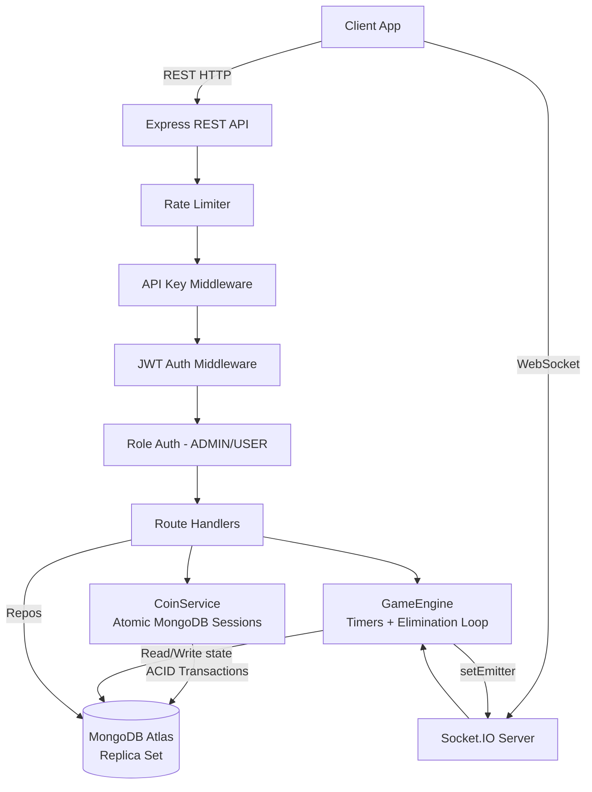

# RoxStar Spin Wheel Backend

## 📖 Overview

RoxStar Spin Wheel is a **real-time, multiplayer game backend** built for the RoxStar App (SMI Pvt Ltd) — India's next music platform with 100,000+ users and Microsoft-experienced leadership.

The system features a robust coin economy, atomic financial transactions, real-time player elimination mechanics, and production-oriented resilience patterns.

**The Game Logic:**

1. An **Admin** creates a Spin Wheel game room with a set entry fee.
2. **Players join** the waiting room and pay the entry fee — coins are immediately split into prize pools.
3. After 3 minutes (or manual admin trigger), a **Fisher-Yates random elimination sequence** begins — provided at least **3 players** joined. If fewer than 3 joined, the game auto-aborts with full refunds. Otherwise, players are knocked out one every 7 seconds.
4. The **last player standing wins** the majority coin pool. Admin and platform take their configured percentage cut.

---

## 🛠 Tech Stack

| Layer      | Technology                | Why                                                    |
| :--------- | :------------------------ | :----------------------------------------------------- |
| Runtime    | Node.js + TypeScript      | Type safety, async I/O, non-blocking game loops        |
| Framework  | Express.js v4             | Stable, production-proven REST framework               |
| Database   | MongoDB + Mongoose        | Flexible schema + ACID transactions via replica sets   |
| Real-time  | Socket.IO                 | Room-based WebSocket broadcasting                      |
| Auth       | JWT RS256 (asymmetric)    | Private key signs, public key verifies — distributable |
| Validation | Zod                       | Strict schema parsing at runtime                       |
| Logging    | Winston + DailyRotateFile | Structured logs with automatic daily rotation          |

---

## 🛡️ Security Architecture

This system implements **production-oriented security patterns** throughout:

- **API Key Authentication**: Every request must carry a valid `x-api-key` header. Keys are stored hashed in the DB and validated before any route logic runs.

- **Asymmetric JWT (RS256)**: Unlike symmetric HS256, RS256 uses a private key to sign and a public key to verify. This means the architecture can be **extended to support microservice environments** where downstream services verify tokens using only the public key — no shared secret, no single point of compromise.

- **Token Rotation via Keystore**: Access tokens are paired with a keystore entry in MongoDB. On signout, the keystore entry is deleted, **invalidating the token server-side** even before it expires — something pure JWT cannot achieve.

- **Rate Limiting**:
  - Join endpoint: **10 requests/min per IP** — prevents spam joins and artificial race conditions.
  - Auth endpoints: **20 attempts/15 minutes per IP** — prevents brute-force credential attacks.

- **Input Validation & Payload Limits**: Zod schemas sanitize all incoming request bodies, headers, and params before they reach controllers. Express is configured with a `10mb` payload limit to prevent memory exhaustion attacks.

- **Helmet.js**: HTTP security headers set on all responses (XSS protection, content type sniffing prevention, etc.).

---

## ⚡ Concurrency & Data Integrity

The hardest engineering problem in this system is ensuring **coins are never created, destroyed, or duplicated** under concurrent load.

- **ACID Transactions**: All coin operations (entry fee split, payout, refund) are wrapped in **MongoDB sessions**. If any step fails, the entire transaction rolls back. No partial state is ever committed.

- **Atomicity Guarantee**: If two users attempt to join simultaneously, **database-level isolation** ensures only valid state transitions are committed. The `$inc` operator on `participantsCount` is atomic by nature — MongoDB guarantees it executes as a single operation regardless of concurrency.

- **Optimistic Balance Validation**: Before debiting, the system reads the user's current balance and validates sufficiency. This check and the debit happen within the same transaction scope, preventing **time-of-check to time-of-use (TOCTOU)** race conditions.

- **Unique Compound Index**: `{ spinWheelId: 1, userId: 1 }` on the `participants` collection prevents double-joins at the **database engine level** — even if application-level checks are bypassed under concurrent load.

---

## 🔄 Failure Recovery Strategy

Designed to be **resilient against sudden crashes and network failures**:

- **Crash Recovery for ACTIVE games**: If the Node process dies mid-elimination, restarting the server queries MongoDB for any `ACTIVE` spin wheels and **re-hydrates the elimination loop** from the persisted `eliminationSequence` array, continuing from `currentEliminationIndex`.

- **Crash Recovery for WAITING games**: If the server crashes during the 3-minute waiting period (timer was in memory, now gone), on boot the server immediately re-evaluates the game — either auto-starting or aborting with refunds.

- **Idempotency in Elimination**: The elimination loop validates participant status before marking eliminated. **A player cannot be eliminated twice**, even if a message is duplicated or the loop resumes mid-sequence.

- **Transaction Rollbacks**: MongoDB sessions guarantee that if a crash occurs during coin transfer, either **all balances update atomically or none do**. No coins are ever orphaned in a partial state.

- **Selective Refunds on Abort**: If a game is aborted while `WAITING`, all participants are refunded. If aborted while `ACTIVE`, only **surviving (non-eliminated) participants** receive refunds — players who were already eliminated are not refunded as they participated.

---

## 📈 Scalability Design

- **Stateless REST API**: The Express application holds no per-request state, making it **horizontally scalable behind a load balancer** without sticky sessions.

- **MongoDB Connection Pooling**: Configured with `minPoolSize: 2, maxPoolSize: 10` to reuse connections efficiently under load.

- **`.lean()` Queries**: All read operations use Mongoose's `.lean()` to return plain JavaScript objects, **bypassing full document hydration** for significantly faster reads.

- **Pre-Shuffled Elimination Order**: The Fisher-Yates shuffle runs **once at game start** and is stored in the DB. The 7-second elimination loop simply reads the next index — no runtime CPU spikes per elimination tick.

- **Targeted WebSocket Broadcasts**: Socket.IO rooms ensure elimination events are broadcast **only to participants of that specific game**, not all connected clients. This prevents unnecessary network overhead as concurrent games scale.

- **MongoDB Sharding Ready**: Heavy collections (`transactions`, `participants`) are indexed on `userId` and `spinWheelId` — natural shard keys for horizontal partitioning as data grows.

**⚠️ Known Scaling Limitation (Honest):**
The current timer system (`setTimeout`/`setInterval`) is **instance-bound in Node.js memory**. For true multi-instance horizontal scaling, this would need to be migrated to a **Redis-backed distributed task queue** (e.g., BullMQ) alongside `@socket.io/redis-adapter` for cross-node WebSocket broadcasting. This is the documented next step.

Additionally, the **single active game constraint** (only one wheel in `WAITING` or `ACTIVE` at a time) is a product-level design decision that may become a bottleneck under high user concurrency. Supporting parallel concurrent games would require a redesign of the game lifecycle management layer.

---

## 🚀 Setup & Deployment

### Prerequisites

- Node.js >= 18
- MongoDB with **Replica Set** enabled (required for ACID transactions)

> **Local dev note**: MongoDB Atlas provides replica sets by default. For local MongoDB, start with:
>
> ```bash
> mongod --replSet rs0
> ```

### 1. Clone & Install

```bash
git clone https://github.com/Priyasaha7/roxstar-spinwheel-backend.git
cd roxstar-spinwheel-backend
npm install
```

### 2. Configure Environment

```bash
cp .env.example .env
```

Edit `.env`:

```env
# Server
PORT=3000
NODE_ENV=development

# ⚠️ Change ORIGIN_URL to your frontend URL in production
# Leaving it as * in production exposes CORS risks
ORIGIN_URL=*

# MongoDB (Atlas or local replica set)
DB_HOST=your-cluster.mongodb.net
DB_NAME=roxstar_spinwheel
DB_USER=your_db_user
DB_USER_PASSWORD=your_db_password
DB_MIN_POOL_SIZE=2
DB_MAX_POOL_SIZE=10

# JWT
ACCESS_TOKEN_VALIDITY_SEC=3600
REFRESH_TOKEN_VALIDITY_SEC=86400
TOKEN_ISSUER=roxstar
TOKEN_AUDIENCE=roxstar-app

LOG_DIRECTORY=logs
```

### 3. Generate RSA Keys

```bash
npm run generate-keys
```

Creates `keys/private.pem` (signing) and `keys/public.pem` (verification). These are `.gitignored` — **never commit them**.

### 4. Seed the Database

```bash
# Creates USER + ADMIN roles and default GameConfig (70% winner / 20% admin / 10% app)
npm run seed:roles

# Generates an API key — copy the printed value, you need it in every request
npm run seed:apikey
```

### 5. Run

```bash
# Development (hot reload via nodemon)
npm run dev

# Production
npm run build
npm start
```

---

## 💰 Coin Flow Economy

The financial engine relies on **atomic state transitions** to guarantee zero coin-loss at every step.

```
┌─────────────────────────────────────────────────────────────┐
│                     PLAYER JOINS                            │
│                                                             │
│  user.coins  ──debit──►  entry fee collected                │
│                               │                            │
│              ┌────────────────┼────────────────┐           │
│              ▼                ▼                ▼           │
│        winnerPool(X%)   adminPool(Y%)    appPool(Z%)        │
│       stored on SpinWheel document (cumulative per join)    │
└─────────────────────────────────────────────────────────────┘

┌─────────────────────────────────────────────────────────────┐
│                     GAME ENDS                               │
│                                                             │
│  totalWinnerPool ──► credited to winner.coins               │
│  totalAdminPool  ──► credited to admin.coins (creator)      │
│  totalAppPool    ──► stays in platform (no credit)          │
└─────────────────────────────────────────────────────────────┘

┌─────────────────────────────────────────────────────────────┐
│                     GAME ABORTS                             │
│                                                             │
│  entryFee ──► refunded to each eligible participant.coins   │
│  (Eligible = not yet eliminated at time of abort)           │
└─────────────────────────────────────────────────────────────┘
```

- **Rounding**: `appPercent` receives the remainder after `winnerPercent + adminPercent` are floored. This ensures no fractional coins are lost due to integer rounding.
- **Auditability**: Every coin movement — debit, pool credit, payout, refund — is recorded in the `transactions` collection with `balanceBefore` and `balanceAfter` snapshots, creating a **fully traceable and auditable financial trail** suitable for financial-grade debugging and reconciliation.

---

## 🔌 API Reference

**Every request requires:** `x-api-key: YOUR_API_KEY` header

**Protected routes also require:** `Authorization: Bearer YOUR_ACCESS_TOKEN`

**Standard Success Response:**

```json
{
  "statusCode": "10000",
  "success": true,
  "message": "Operation successful.",
  "data": {}
}
```

**Standard Error Response:**

```json
{
  "statusCode": "10001",
  "success": false,
  "message": "This spin wheel is no longer accepting participants."
}
```

> `statusCode` is an **internal application code** used for frontend mapping and logging — separate from the HTTP status code (200, 400, etc.) which is also returned.

### Auth Endpoints

| Method   | Endpoint              | Auth Required | Description              |
| :------- | :-------------------- | :------------ | :----------------------- |
| `POST`   | `/auth/signup`        | No            | Register new user        |
| `POST`   | `/auth/signin`        | No            | Login, receive tokens    |
| `DELETE` | `/auth/signout`       | Yes           | Logout, invalidate token |
| `POST`   | `/auth/token/refresh` | Yes           | Refresh access token     |

### Spin Wheel Endpoints

| Method | Endpoint                      | Role  | Description                               |
| :----- | :---------------------------- | :---- | :---------------------------------------- |
| `GET`  | `/spinwheel/active`           | User  | Get current active/waiting wheel          |
| `POST` | `/spinwheel/create`           | Admin | Create new wheel + start 3-min timer      |
| `POST` | `/spinwheel/:id/join`         | User  | Join wheel (deducts entry fee atomically) |
| `POST` | `/spinwheel/:id/start`        | Admin | Manual start before 3-min timer           |
| `POST` | `/spinwheel/:id/abort`        | Admin | Abort game + refund survivors             |
| `GET`  | `/spinwheel/:id/participants` | User  | List all participants                     |
| `GET`  | `/spinwheel/dashboard`        | Admin | Active game + recent 10 games             |
| `GET`  | `/spinwheel/history/me`       | User  | Personal transaction history              |

**Example: Join Request**

```http
POST /spinwheel/507f1f77bcf86cd799439011/join
x-api-key: abc123def456...
Authorization: Bearer eyJhbGci...

Response 200:
{
  "statusCode": "10000",
  "success": true,
  "message": "Successfully joined the spin wheel. Good luck!"
}

Response 400 (already joined):
{
  "statusCode": "10001",
  "success": false,
  "message": "You have already joined this spin wheel."
}

Response 400 (insufficient coins):
{
  "statusCode": "10001",
  "success": false,
  "message": "Insufficient coins to join."
}
```

---

## 📡 WebSocket Lifecycle

**Connect** to `ws://your-server:3000` using Socket.IO client, then join a room:

```javascript
import { io } from "socket.io-client";

const socket = io("http://localhost:3000");

// Join the room for your specific game
socket.emit("join:room", spinWheelId);

// Listen for game events
socket.on("game:started", (data) => console.log("Game started!", data));
socket.on("game:elimination", (data) =>
  console.log("Eliminated:", data.eliminatedUserId),
);
socket.on("game:finished", (data) => console.log("Winner:", data.winnerId));
socket.on("game:aborted", (data) => console.log("Aborted:", data.reason));
```

**Event Reference:**

| Event              | Direction       | Payload                             | Trigger                   |
| :----------------- | :-------------- | :---------------------------------- | :------------------------ |
| `join:room`        | Client → Server | `spinWheelId: string`               | Client subscribes to game |
| `game:started`     | Server → Client | `{ spinWheelId, participantCount }` | Game loop begins          |
| `game:elimination` | Server → Client | `{ eliminatedUserId, remaining }`   | Every 7 seconds           |
| `game:finished`    | Server → Client | `{ winnerId }`                      | Last player survives      |
| `game:aborted`     | Server → Client | `{ spinWheelId, reason }`           | Game cancelled            |

**Real-World Concerns Handled:**

- **Scoped Broadcasts**: Events target only the specific game room — no client cross-talk between concurrent games.
- **Ordering Guarantee**: Events are emitted sequentially from the game loop, ensuring **consistent elimination order across all connected clients**. No client can receive eliminations out of sequence.
- **Reconnection**: If a client disconnects, they re-emit `join:room` on reconnect. The server is the single source of truth — UI state can be restored from the REST API without desync.
- **Duplicate Connections**: Multiple tabs from the same user receive events safely; deduplication is handled at the UI layer.

---

## 🗃️ Database Schema

### Collections Overview

| Collection     | Purpose                    | Key Indexes                                                   |
| :------------- | :------------------------- | :------------------------------------------------------------ |
| `users`        | Auth + coin wallet         | `_id + status`, `email`                                       |
| `roles`        | USER / ADMIN roles         | `code + status`                                               |
| `keystores`    | JWT token rotation pairs   | `client + primaryKey + status`                                |
| `api_keys`     | API key management         | `key + status`                                                |
| `spin_wheels`  | Game state + pools         | `status`, `createdBy`                                         |
| `participants` | Who joined which game      | `spinWheelId + userId` (unique), `spinWheelId + isEliminated` |
| `transactions` | Immutable coin audit trail | `userId + createdAt`, `spinWheelId`                           |
| `game_configs` | DB-driven pool split %     | `isActive`                                                    |

### Why Separate `participants` Collection?

Embedding participants inside the `SpinWheel` document would cause it to **grow unboundedly** with each join (MongoDB has a 16MB document limit). A separate collection also enables independent queries like "all games user X participated in" for history/analytics — impossible with embedding.

### Immutable Transaction Ledger

The `transactions` collection uses `timestamps: { createdAt: true, updatedAt: false }` — transactions are **write-once and never modified**. Every entry records `balanceBefore` and `balanceAfter`, creating a snapshot pattern that allows full financial reconstruction even if user documents change. This makes the system a **fully traceable and auditable financial trail**.

### GameConfig — DB-Driven Percentages

The coin split (`winnerPercent`, `adminPercent`, `appPercent`) lives in MongoDB, not in code. The CTO can **adjust revenue splits without a deployment**. A `pre('save')` validator enforces that the three percentages always sum to exactly 100.

---

## 🧪 Testing

```bash
npm test
```

The test suite is focused on **critical paths and edge cases** — the scenarios most likely to cause production incidents:

- **Integration: Full Join Flow** — Auth → validate status → deduct coins → add participant → verify DB state
- **Concurrency: Simultaneous Joins** — Two requests for same user on same wheel; only one succeeds
- **Financial: Insufficient Funds** — CoinService rejects and rolls back when balance is too low
- **Financial: Atomic Payout** — Winner and admin credited correctly; transaction records match
- **Financial: Transaction Rollback** — Simulate failure mid-operation and verify no partial DB updates are committed
- **Crash Recovery: ACTIVE game** — Game loop resumes from correct `currentEliminationIndex`
- **Edge: Join After Game Starts** — Correct 400 error returned; no coin deduction

---

## ✅ Edge Cases Handled

| #   | Edge Case                          | How It's Handled                                                |
| :-- | :--------------------------------- | :-------------------------------------------------------------- |
| 1   | User tries to join twice           | Unique DB index `{spinWheelId, userId}` rejects at engine level |
| 2   | Two users join simultaneously      | MongoDB atomic `$inc` + session isolation                       |
| 3   | < 3 players after 3 min            | Auto-abort + full refund to all participants                    |
| 4   | Server crash mid-game              | ACTIVE games resume from `eliminationSequence` on restart       |
| 5   | Server crash during waiting        | WAITING games are immediately re-evaluated on boot              |
| 6   | Admin schedules duplicate timer    | Guard checks `activeTimers` Map before scheduling               |
| 7   | Admin starts game twice            | Guard checks `eliminationIntervals` Map                         |
| 8   | Player eliminated twice            | Loop checks `remaining` Set before processing                   |
| 9   | User has insufficient coins        | Pre-debit balance check + transaction rollback                  |
| 10  | Join after game started            | Status check `!== WAITING` rejects request with 400             |
| 11  | Abort during active elimination    | Only surviving players refunded; eliminated players are not     |
| 12  | Malformed ObjectId in params       | Zod param validation rejects before DB hit                      |
| 13  | Non-admin creates wheel            | `authorize(RoleCode.ADMIN)` middleware returns 403              |
| 14  | Admin aborts another admin's wheel | Creator ID check returns 403                                    |
| 15  | Game config missing from DB        | Explicit InternalError thrown with helpful message              |

---

## 📁 Project Structure

```
src/
├── core/
│   ├── ApiError.ts        # Error class hierarchy (15 typed errors)
│   ├── ApiResponse.ts     # Consistent response formatting
│   ├── asyncHandler.ts    # Express async wrapper (centralizes catch)
│   ├── authUtils.ts       # Token creation + validation helpers
│   ├── jwtUtils.ts        # RS256 encode / decode / validate
│   └── logger.ts          # Winston with daily rotation
│
├── database/
│   ├── models/            # Mongoose schemas with indexes + validators
│   └── repositories/      # DB abstraction layer — no business logic here
│
├── helpers/
│   ├── validator.ts       # Zod custom types (ObjectId, Bearer token)
│   ├── generateApiKey.ts  # Seed script: API key
│   └── seedRoles.ts       # Seed script: roles + GameConfig
│
├── middlewares/
│   ├── authorize.middleware.ts   # Role-based access control (ADMIN/USER)
│   ├── error.middleware.ts       # Global error handler
│   ├── permission.middleware.ts  # API key permission check
│   ├── rateLimit.middleware.ts   # IP-based rate limiting
│   └── validator.middleware.ts   # Zod schema validation on requests
│
├── routes/
│   ├── auth/              # signup, signin, signout, token refresh
│   ├── health/            # GET / and GET /health
│   └── spinwheel/         # Full game lifecycle endpoints
│
├── services/
│   └── spinwheel/
│       ├── CoinService.ts    # All atomic MongoDB session operations
│       └── GameEngine.ts     # Timers, elimination loop, crash recovery
│
├── sockets/
│   └── index.ts           # Socket.IO init + room management + emitter wiring
│
├── types/                 # TypeScript interfaces for all entities
├── app.ts                 # Express configuration (CORS, helmet, routes)
├── config.ts              # Env var parsing + game constants
└── index.ts               # Entry point + boot-time crash recovery
```

---

## 📌 Assumptions & Design Decisions

1. **Integer coins only** — No decimal coins. Entry fees and payouts are whole numbers. Rounding remainder always goes to `appPool`.
2. **Admin = wheel creator** — The admin who creates a wheel is the one who receives the `totalAdminPool` payout. A different admin cannot claim another's payout.
3. **Single active game** — Only one wheel can be in `WAITING` or `ACTIVE` state at a time. This is enforced at the application layer (checked before `create`) and is by product design.
4. **GameConfig is global** — One active config applies to all games. Changing it mid-game does not affect running games (pools are already calculated and stored on the SpinWheel document).
5. **Replica set required** — MongoDB transactions require a replica set. MongoDB Atlas satisfies this. Local setup requires `mongod --replSet rs0`.
6. **Minimum 3 participants** — Configurable via `gameConfig.minParticipants` in `config.ts`. Currently set to 3 as per the assignment spec. If fewer than 3 join within the 3-minute window, the game auto-aborts and all participants are fully refunded.

---

## 🔮 Future Improvements

| Improvement                    | Why It Matters                                                   |
| :----------------------------- | :--------------------------------------------------------------- |
| **Redis + BullMQ for timers**  | Enables multi-instance horizontal scaling of game loops          |
| **`@socket.io/redis-adapter`** | Multi-node WebSocket broadcasting across instances               |
| **Global leaderboard**         | MongoDB aggregation pipelines for top winners by coin earnings   |
| **Admin analytics dashboard**  | Revenue tracking, game frequency, platform pool accumulation     |
| **Webhook notifications**      | Notify users of game results via push/SMS even when disconnected |
| **Spectator mode**             | Allow non-participants to watch live eliminations via WebSocket  |

---

## 🏛 Architecture Diagram



---

## 👩‍💻 Author

Designed and implemented as part of a backend engineering assessment for **RoxStar App (SMI Pvt Ltd)**.

Demonstrates: ACID transactions, real-time WebSocket architecture, RS256 auth, crash-resilient game loops, race condition handling, and production-grade Node.js patterns.
